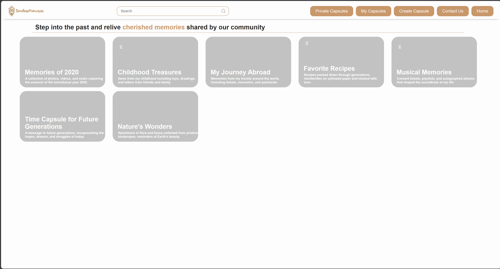
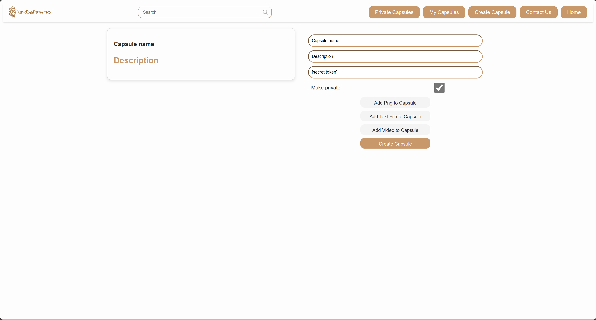
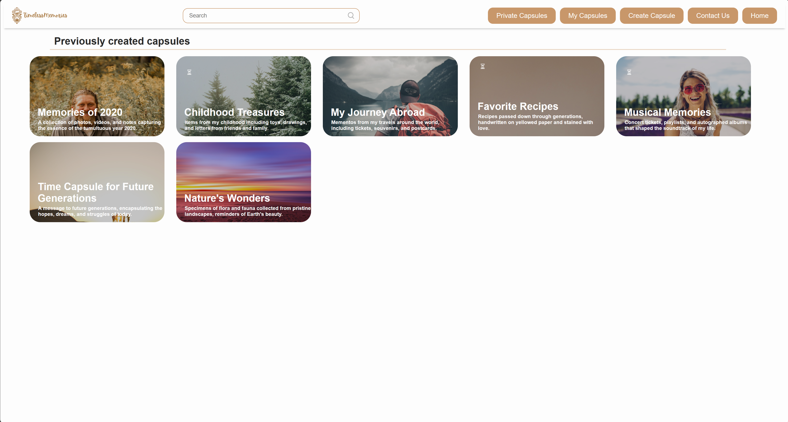

# Timeless Memories

## Introduction
Timeless Memories was developed during the FII Practic Hackathon 2024, organized by the Faculty of Computer Science at the University of Iasi. 
The project was created by a team of five students with a passion for software development and a desire to build innovative and impactful solutions. 

## Description
Timeless Memories is an online platform with full-stack functionalities designed for
preserving memories and experiences over time. Users can encapsulate memories in the form of text, 
video, or audio and open them after a certain period of time. Whether it's a special memory, favorite
places, or moments with loved ones, Time Capsule is a tool that helps users preserve and revisit those
important moments in the future.

## Key Features

- **Authentication with Google and GitHub:** Users can quickly and securely authenticate using their Google or GitHub accounts.
- **Create and Manage Capsules:** Users can create new time capsules and manage them, adding or removing text, video, or audio content.
- **Lock for Video Content:** Video content can be locked and accessed only after the user pays to unlock it.
- **Social Networking:** Capsules can be public or private, and users can interact and share capsules with each other.
- **Capsule Gifting:** Users can gift capsules using two security keys: a capsule token and a user token.
- **Feed with Open Capsules:** Users can explore and discover capsules already opened by other users in a dedicated feed.

## Technologies Used

- **Frontend**: React.js
- **Backend**: Java Spring
- **Authentication**: OAuth with Google and GitHub
- **File Storage and Management**: JSZip (for archiving and managing capsule content)


## Technical Implementation

- **Frontend:** The user interface is developed using React.js, providing an interactive and responsive experience.
- **Backend:** The server is built with Java Spring, providing a robust API for handling requests from the frontend and interacting with the database.
- **Authentication and Authorization:** User authentication is done through OAuth with Google and GitHub, ensuring secure and easy authentication.


### File Storage and Management

- **Database Storage:** User-uploaded files, including text, video, and audio content, are stored efficiently in the database.
- **JSZip for Archiving:** When a user requests their stored data, the backend dynamically creates a zip file using JSZip library, bundling all the relevant files together.
- **Efficient Delivery:** The zip file is then sent from the backend to the frontend, ensuring efficient and manageable transfer of user data.


## Contributors

- **Ochian Andrei-Iulian** - Backend Developer
- **Gorea Ioana Miruna** - Backend Developer
- **Branzei Bianca** - Frontend Developer
- **Murarescu Ilinca** - Frontend Developer
- **Maxiniuc Diana-Alexandra** - UI/UX Designer


## Before Starting the Project
- **Install Node.js:** Make sure you have Node.js installed on your system.
- **Install Java:** Ensure you have Java installed on your system.
- **Install MySQL:** Set up a MySQL database for storing user data.
- **Install IDE:** Use an IDE like IntelliJ IDEA for Java development and Visual Studio Code for React development.
- **Install Git:** Install Git for version control and collaboration.
- **Set Up Google and GitHub OAuth:** Create OAuth credentials for Google and GitHub authentication.


## Running the Project
1. **Clone the Repository:** Clone the repository to your local machine using the following command:
   ```bash
   git clone
   ```
2. Backend:
   - Navigate to the backend directory and run the Java Spring server.
   - Ensure the server is running on the appropriate port and connected to the database.
3. Frontend:
   - Navigate to the frontend directory and start the React.js application.
   - Open the application in a browser and start exploring and using the Time Capsule functionalities.


## Feedback and Contributions
We encourage you to send us feedback and suggestions for continuous improvement of the project. We are also open to contributions and enhancements from the developer community.

### Preview Images

Here are some screenshots showcasing the main aspects of the project:








